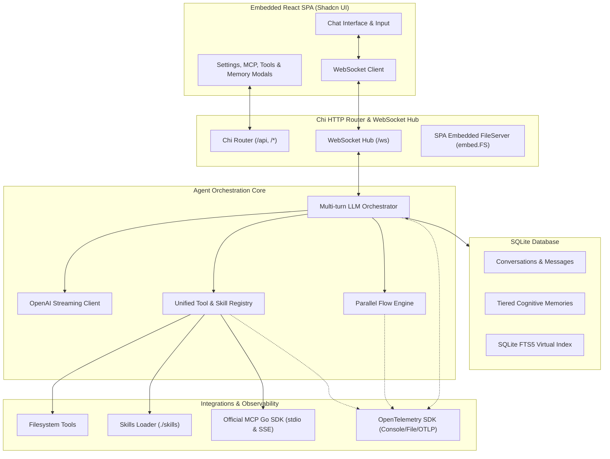

# Go Agent Harness

<p align="center">
  <strong>Production-ready, modular Go AI Agent Harness with an embedded Shadcn/UI React SPA, official MCP Go SDK, multi-tier cognitive memory, parallel subflow execution, and OpenTelemetry tracing.</strong>
</p>

<p align="center">
  <a href="https://golang.org"></a>
  <a href="https://react.dev"></a>
  <a href="https://ui.shadcn.com"></a>
  <a href="https://github.com/modelcontextprotocol/go-sdk"></a>
  <a href="https://opentelemetry.io"></a>
  <a href="https://sqlite.org"></a>
</p>

<p align="center">
  <a href="#quick-start">Quick Start</a> &middot;
  <a href="#features">Features</a> &middot;
  <a href="#architecture">Architecture</a> &middot;
  <a href="#cognitive-memory-subsystem">Memory System</a> &middot;
  <a href="#mcp-integration">MCP Integration</a> &middot;
  <a href="#opentelemetry-tracing">Tracing</a> &middot;
  <a href="#api-reference">API Reference</a> &middot;
  <a href="#configuration">Configuration</a>
</p>

---

## Why Go Agent Harness?

Building robust AI agents requires more than basic LLM API wrappers. Agents need **extensible tools**, **external context from Model Context Protocol (MCP) servers**, **cognitive tiered memory** that bridges short-term turns with long-term retention, **parallel sub-flow delegation**, and **enterprise-grade OpenTelemetry observability**—all served with zero external runtime dependencies.

**Go Agent Harness bundles everything into a single, high-performance static binary under 50MB:**

| Feature | Go Agent Harness | LangChain / Python Stacks | Traditional Go Frameworks |
|---|:---:|:---:|:---:|
| **Single Static Binary** | **Yes (`embed.FS`)** | No | Optional |
| **Official MCP Go SDK** | **Yes (`modelcontextprotocol/go-sdk`)** | Partial | No |
| **Cognitive Memory Model** | **Tiered (Short + Long-Term FTS5)** | Custom Vector DB required | No |
| **Parallel Flow Delegation** | **Built-in (`spawn_parallel_flow`)** | Complex Celery/Async setup | No |
| **OpenTelemetry Multi-Export** | **Console, File, OTLP, All** | Plugin required | No |
| **Embedded Shadcn SPA** | **Built-in (React 19 + Tailwind)** | Separate frontend process | No |
| **Memory / CPU Footprint** | **<25MB RAM** | 200MB - 1GB+ | 30MB - 80MB |

---

## Features

- **OpenAI-Compatible LLM Orchestration:**
  - Configurable endpoint URL, model, temperature, max tokens, and API key at runtime.
  - Native compatibility with **OpenAI**, **Ollama**, **vLLM**, **LMStudio**, **LocalAI**, and **OpenRouter**.
  - Multi-turn execution loop with tool invocation, error recovery, and context cancellation.

- **Official Model Context Protocol (MCP) Integration:**
  - Built with the official `github.com/modelcontextprotocol/go-sdk`.
  - Supports **`stdio`** child process execution (with custom commands, arguments, and environment variables).
  - Supports **`sse` / `http`** remote streaming transports.
  - Dynamic tool schema translation, prompt discovery, resource/artifact reading, and live connect/disconnect UI controls.

- **Cognitive Tiered Memory Subsystem:**
  - **Short-Term Memory:** Working context window, prompt-response semantic cache.
  - **Long-Term Memory:** Semantic facts & user profiles, Episodic logs of past actions, Procedural workflow rules.
  - **SQLite FTS5 Virtual Table Search:** Fast keyword and tag-based BM25 relevance search with zero external vector DB dependencies.
  - **Automatic Aging & Promotion:** Automatically promotes frequently referenced short-term memories into permanent long-term storage based on access frequency and age.

- **Parallel Subflow Orchestration:**
  - Agent tool `spawn_parallel_flow` enables dynamic fan-out execution of independent sub-tasks across concurrent worker goroutines.
  - Live progress cards streamed over WebSockets to the UI.
  - Automatic fan-in structured synthesis returned directly to the main conversation loop.

- **OpenTelemetry Multi-Pipeline Tracing:**
  - Instrument LLM completion durations, token metrics, tool executions, skill evaluations, and parallel subflows.
  - Configurable exporters: `console` (stdout), `file` (JSON trace log), `otlp` (remote gRPC/HTTP collector), `all`, or `none`.

- **Built-in Filesystem Tools & Dynamic Skills Loader:**
  - File tools: `read_file` (with line range slicing), `write_file` (auto-creates directories), `update_file` (targeted block search and replace), `list_directory` (recursive tree exploration).
  - Dynamic skill discovery: Scans `skills/` for `SKILL.md` (with YAML frontmatter) and automatically injects active skills into agent system instructions.
  - Granular enable/disable toggles for every individual tool and skill.

- **Embedded Shadcn/UI React SPA:**
  - Built with React 19, Tailwind CSS, Lucide icons, and Radix UI / Shadcn components.
  - Markdown streaming token rendering, collapsible tool execution cards, parallel flow status cards, and memory context chips.
  - Modals for runtime LLM settings, MCP servers, Tools & Skills registry, Memory explorer, and Conversation history.
  - Conversation management: Load, delete, and **export conversation history to RFC4180 CSV**.
  - Persistent safety disclaimer: *"AI can make mistakes, so double-check responses"*.
  - Embedded directly into the Go executable via `embed.FS` with SPA client-side routing fallback.

---

## Architecture



---

## Quick Start

### Prerequisites
- **Go 1.26+**
- **Node.js 20+** and **pnpm** (only needed when building frontend assets)

### 1. Build and Run

```bash
# Build React frontend + compile single Go binary
make build

# Start the harness
./go-harness
```

### 2. Access the Web Dashboard
Open your browser and navigate to:
```
http://localhost:8080
```

### 3. Development Mode
```bash
# Terminal 1: Run Go backend
make dev-api

# Terminal 2: Run React Vite dev server with hot reload
make dev-web
```

---

## Cognitive Memory Subsystem

The harness implements a cognitive memory hierarchy inspired by cognitive architectures:

```
┌─────────────────────────────────────────────────────────────┐
│                    AGENT MEMORY SYSTEM                      │
├──────────────────────────────┬──────────────────────────────┤
│      SHORT-TERM MEMORY       │       LONG-TERM MEMORY       │
├──────────────────────────────┼──────────────────────────────┤
│ • Working Context (turn/task)│ • Semantic (facts & profiles)│
│ • Semantic Prompt Cache      │ • Episodic (history & logs)  │
│                              │ • Procedural (how-to rules)  │
├──────────────────────────────┴──────────────────────────────┤
│               SQLite FTS5 Full-Text Search                  │
│       Auto-Aging & Promotion based on access count          │
└─────────────────────────────────────────────────────────────┘
```

- **FTS5 Search Tool (`search_memory`):** Searches memory bank using Porter-stemmed BM25 keyword matching.
- **Save Memory Tool (`save_memory`):** Stores structured memories with key, content, memory_type, and tags.
- **Auto-Promotion (`POST /api/memories/promote`):** Scans short-term memories and promotes items with `access_count >= 2` to long-term memory.

---

## MCP (Model Context Protocol) Integration

The harness utilizes the official **`github.com/modelcontextprotocol/go-sdk`** to connect to any MCP-compliant server:

### 1. Stdio Sub-process
Runs local tools/binaries (e.g. Node/Python tools) communicating via `stdin`/`stdout`:
```json
{
  "name": "Filesystem MCP",
  "transport": "stdio",
  "command": "npx",
  "args": ["-y", "@modelcontextprotocol/server-filesystem", "/path/to/allowed/dir"]
}
```

### 2. HTTP / SSE Stream
Connects to remote or containerized MCP servers over HTTP/SSE:
```json
{
  "name": "Remote Database MCP",
  "transport": "sse",
  "url": "http://localhost:3000/sse"
}
```

Discovered MCP tools are automatically namespaced (`mcp_<server>_<tool>`), converted to OpenAI JSON function schemas, and instrumented with OpenTelemetry child spans.

---

## OpenTelemetry Tracing

Configure tracing destinations via `.env` or runtime settings:

```bash
# Available options: "console", "file", "otlp", "all", "none"
OTEL_EXPORTER=console,file
TRACE_FILE=./logs/traces.json
OTEL_ENDPOINT=localhost:4317
```

### Emitted Spans & Metrics:
- **`agent.turn`**: Overall multi-turn conversation span.
- **`llm.completion`**: Chat completion latency, model name, prompt tokens, completion tokens.
- **`tool.<name>`**: Tool execution duration, input arguments, and result previews.
- **`mcp.call_tool.<name>`**: External MCP remote execution duration.
- **`flow.parallel_execution` & `flow.subtask.<id>`**: Sub-agent concurrency hierarchy.

---

## Configuration Reference

Set these in `.env` or as environment variables:

| Variable | Default | Description |
| :--- | :--- | :--- |
| `PORT` | `8080` | HTTP and WebSocket server port |
| `HOST` | `0.0.0.0` | Bind host address |
| `LOG_LEVEL` | `info` | Logging level (`debug`, `info`, `warn`, `error`) |
| `LOG_FORMAT` | `console` | Log format (`console` pretty colorized, or `json`) |
| `SKILLS_DIR` | `./skills` | Directory containing dynamic skill folders |
| `DB_PATH` | `./data/harness.db` | Local SQLite database file path |
| `OTEL_EXPORTER` | `console` | Trace exporter (`console`, `file`, `otlp`, `all`, `none`) |
| `OTEL_ENDPOINT` | `localhost:4317` | Remote OTLP gRPC endpoint |
| `TRACE_FILE` | `./logs/traces.json` | Local file path for exported JSON traces |
| `LLM_BASE_URL` | `https://api.openai.com/v1` | OpenAI-compatible endpoint URL |
| `LLM_MODEL` | `gpt-4o` | LLM model identifier |
| `LLM_API_KEY` | `""` | Optional API key |
| `LLM_TEMPERATURE`| `0.7` | Sampling temperature (`0.0` to `1.5`) |
| `LLMMaxTokens` | `4096` | Maximum generation tokens |

---

## API Reference

### REST Endpoints

| Method | Endpoint | Description |
| :--- | :--- | :--- |
| `GET` | `/api/health` | Health check & system timestamp |
| `GET` | `/api/settings` | Get current runtime settings |
| `POST`| `/api/settings` | Update runtime LLM & harness settings |
| `GET` | `/api/conversations` | List all saved conversation sessions |
| `GET` | `/api/conversations/{id}` | Get conversation metadata & messages |
| `DELETE`| `/api/conversations/{id}` | Delete a conversation session |
| `GET` | `/api/conversations/{id}/export`| Export conversation history as CSV |
| `GET` | `/api/memories?q=&type=` | Search cognitive memory with FTS5 |
| `POST`| `/api/memories` | Add or update a memory item |
| `POST`| `/api/memories/promote` | Promote aging short-term memories to long-term |
| `GET` | `/api/tools` | List all tools and enabled statuses |
| `POST`| `/api/tools/{name}/toggle` | Enable or disable a tool |
| `GET` | `/api/skills` | List loaded skills and enabled statuses |
| `POST`| `/api/skills/{name}/toggle` | Enable or disable a skill |
| `GET` | `/api/mcp/servers` | List configured MCP servers |
| `POST`| `/api/mcp/servers` | Add a new MCP server configuration |
| `POST`| `/api/mcp/servers/{id}/connect` | Connect to an MCP server |
| `POST`| `/api/mcp/servers/{id}/disconnect`| Disconnect from an MCP server |
| `DELETE`| `/api/mcp/servers/{id}` | Remove an MCP server configuration |

### WebSocket Protocol (`/ws`)

#### Inbound Messages (Client → Server)
- **`chat_message`**: `{ "type": "chat_message", "conversation_id": "conv-123", "content": "user query" }`
- **`cancel`**: `{ "type": "cancel", "conversation_id": "conv-123" }`
- **`ping`**: `{ "type": "ping" }`

#### Outbound Messages (Server → Client)
- **`token`**: Real-time token delta `{ "type": "token", "payload": { "delta": "...", "full_text": "..." } }`
- **`tool_call`**: Tool execution status `{ "type": "tool_call", "payload": { "id": "...", "tool": "read_file", "status": "started"|"completed"|"failed", "result": ... } }`
- **`subflow_event`**: Parallel sub-task progress `{ "type": "subflow_event", "payload": { "flow_id": "...", "task_name": "...", "status": "running"|"completed" } }`
- **`memory_event`**: Retrieved context `{ "type": "memory_event", "payload": { "action": "retrieved", "count": 2, "items": [...] } }`
- **`done`**: Turn finished `{ "type": "done", "payload": { "conversation_id": "...", "disclaimer": "AI can make mistakes, so double-check responses" } }`
- **`error`**: Error notification `{ "type": "error", "error": "description" }`

---

## Makefile Commands

| Target | Description |
| :--- | :--- |
| `make build` | Builds React frontend and compiles single Go binary with embedded SPA |
| `make build-go` | Compiles Go binary without rebuilding web assets |
| `make web` | Builds React Vite SPA into `web/dist` |
| `make run` | Runs compiled `go-harness` binary |
| `make dev-web` | Starts frontend development server with hot module reloading (HMR) |
| `make dev-api` | Runs backend server directly with `go run main.go` |
| `make test` | Runs all Go package unit tests |
| `make test-coverage` | Runs unit tests and outputs HTML coverage report (`coverage.html`) |
| `make lint` | Runs Go vet and frontend Oxlint |
| `make fmt` | Formats Go codebase (`go fmt`) |
| `make tidy` | Cleans up Go module dependencies (`go mod tidy`) |
| `make clean` | Removes binary, coverage files, and `web/dist` |
| `make help` | Displays list of available Makefile targets |

---

## License

Licensed under the [MIT License](LICENSE).
